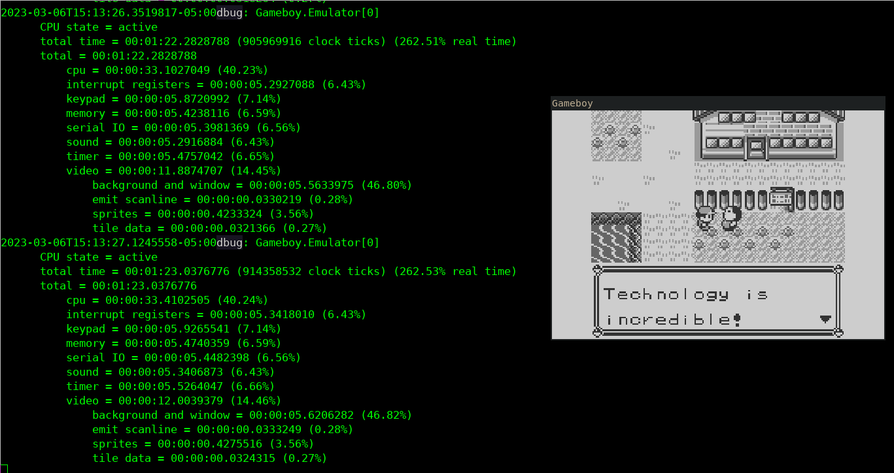

```
dotnet run --configuration Debug --project Gameboy.UI/Gameboy.UI.csproj <ROM>
```

```
dotnet run --configuration Release --project Gameboy.UI/Gameboy.UI.csproj <ROM>
```

----

TODO emulation loop, possible refactor potential?

everything that isn't a CPU ticks together:
- serial IO
	- 4 ticks at a time
	- transfer 4 bits, if this is the complete byte set the interrupt
- timer
	- 4 ticks at a time
	- increment timer register and check for overflow and set interrupt
- video
	- depends on what phase its in?
- sound
	- dunno
- keypad
	- 4 ticks at a time
	- interrupt if keys changed
- interrupt registers
	- no actual tick handling
- memory
	- 4 ticks at a time
	- just DMA

one CPU instruction:
- 1-3 phases, where you do everything else before? after? the instruction phase